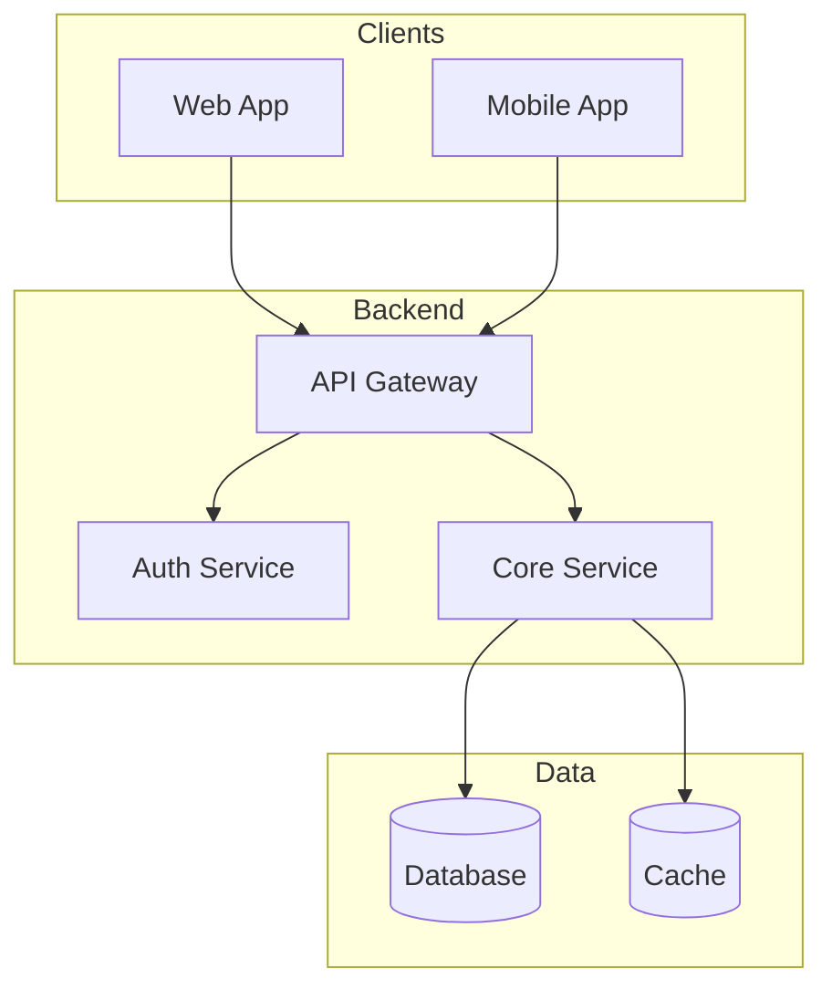

# ARCHITECTURE.md Template

Template structure for generating one-page architecture documents. See [SKILL.md](SKILL.md) for generation principles.

## Full Template

```markdown
# System Architecture

## Overview

[1-2 sentences: what this system does and its architectural style]

## Requirements Summary

### Functional

1. [Core capability that drives architecture]
2. [Core capability that drives architecture]
3. [Core capability that drives architecture]

### Non-Functional

| Category | Requirement | Target |
|----------|-------------|--------|
| Scale | Concurrent users | [number] |
| Performance | API latency | [p95 target] |
| Availability | Uptime | [percentage] |
| Consistency | Model | [strong/eventual] |
| Security | Compliance | [frameworks] |

## Capacity Estimates

```

[Back-of-envelope calculations with assumptions]
Users: X DAU
Requests: Y req/sec average, Z peak
Storage: A GB, growing B% annually

```

## Core Entities

```

[Entity]: [Purpose/role in system]
[Entity]: [Purpose/role in system]

Relationships:
[Entity] ──1:N──▶ [Entity]
[Entity] ──N:1──▶ [Entity]

Access Patterns:
[Entity]: Read-heavy / Write-heavy / Balanced

```

## System Design

```

[ASCII or Mermaid diagram - 5-10 components max]

┌─────────┐     ┌─────────┐     ┌─────────┐
│ Client  │────▶│   API   │────▶│  Store  │
└─────────┘     └─────────┘     └─────────┘

```

## Key Interfaces

| Interface | Type | Purpose |
|-----------|------|---------|
| [Name] | REST/gRPC/Event | [Brief description] |
| [Name] | REST/gRPC/Event | [Brief description] |

## Operational Considerations

| Concern | Approach |
|---------|----------|
| Monitoring | [Key metrics: latency, errors, business metrics] |
| Resilience | [Retry/timeout/circuit breaker strategy] |
| Deployment | [Strategy: rolling/canary/blue-green] |
| DR/Backup | [Backup frequency, RTO/RPO targets] |
| Cost | [Primary drivers and optimization approach] |

## Deep Dive: [Critical Component]

**Challenge**: [What makes this complex]

**Approach**: [Pattern or solution]

**Trade-off**: [What you gave up for what you gained]

## Architectural Decisions

| Decision | Choice | Trade-off |
|----------|--------|-----------|
| [Area] | [What we chose] | [What we gave up] |
| [Area] | [What we chose] | [What we gave up] |
| [Area] | [What we chose] | [What we gave up] |

## Future Considerations

- [Deferred item]: [Trigger for revisiting]
- [Deferred item]: [Trigger for revisiting]

---

**Last Updated:** [YYYY-MM-DD]

```

## Minimal Template

For simpler systems or early-stage projects:

```markdown
# System Architecture

## Overview

[What it is, one sentence]

## Key Requirements

- Scale: [users, requests]
- Latency: [target]
- Availability: [target]

## Design

```

[Simple diagram]

```

## Operations

| Area | Approach |
|------|----------|
| Monitoring | [What to track] |
| Resilience | [Error handling] |
| Deployment | [How to deploy] |

## Decisions

| Decision | Choice | Why |
|----------|--------|-----|
| [Area] | [Choice] | [Reason] |

---

**Last Updated:** [YYYY-MM-DD]
```

## Diagram Templates

### Simple Request Flow

```
┌─────────┐     ┌─────────┐     ┌─────────┐
│ Client  │────▶│   API   │────▶│Database │
└─────────┘     └─────────┘     └─────────┘
```

### With Async Processing

```
┌─────────┐     ┌─────────┐     ┌─────────┐
│ Client  │────▶│   API   │────▶│Database │
└─────────┘     └─────────┘     └─────────┘
                     │
                     ▼
               ┌─────────┐     ┌─────────┐
               │  Queue  │────▶│ Worker  │
               └─────────┘     └─────────┘
```

### Layered Architecture

```
┌────────────────────────────────────────┐
│              Presentation              │
│         (Web, Mobile, API)             │
├────────────────────────────────────────┤
│              Application               │
│         (Business Logic)               │
├────────────────────────────────────────┤
│              Domain                    │
│         (Core Entities)                │
├────────────────────────────────────────┤
│              Infrastructure            │
│      (Database, External Services)     │
└────────────────────────────────────────┘
```

### Event-Driven

```
┌─────────┐     ┌─────────┐
│Service A│────▶│  Event  │
└─────────┘     │   Bus   │
                └────┬────┘
         ┌──────────┼──────────┐
         ▼          ▼          ▼
   ┌─────────┐┌─────────┐┌─────────┐
   │Service B││Service C││Service D│
   └─────────┘└─────────┘└─────────┘
```

### Mermaid Example



## Checklist

Before finalizing, verify the document follows all principles in [SKILL.md](SKILL.md):

- [ ] Fits on one page
- [ ] Technology-agnostic (patterns only)
- [ ] No code, schemas, or implementation details
- [ ] Minimal entity definitions (no attributes)
- [ ] Diagrams are simple and glanceable
- [ ] Trade-offs documented for key decisions
- [ ] Operational considerations included (monitoring, resilience, deployment)
- [ ] Cost drivers identified
