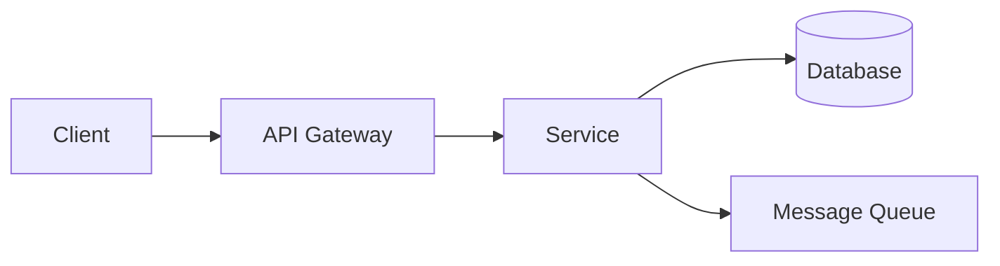

# Architecture Guide

A conversational framework for creating concise, one-page system architecture documents that capture high-level design decisions, constraints, and component relationships.

## Guiding Principles

Balance these considerations in all architectural decisions:

- **Extensibility** - Can the system grow?
- **Maintainability** - Can teams understand and modify it?
- **Cost** - Is it economically sensible?
- **Speed** - Can we ship it quickly?

## When to Activate

Activate this skill when the user:

- Wants to create an architecture document
- Is designing a new system and needs to define structure
- Asks to create an ARCHITECTURE.md file
- Needs help organizing technical design thinking
- Has a PRODUCT.md and wants to design the system

## Prerequisites

Before starting, check for a PRODUCT.md file in the project root. If it exists, read it first to understand:

- Product vision and goals
- Core features and priorities
- Technical constraints already identified
- Target users and their needs

If no PRODUCT.md exists, gather this context conversationally before proceeding.

## Conversational Workflow

### Step 1: Understand the Product Context

If PRODUCT.md exists, summarize your understanding:

- "Based on your product definition, you're building [X] for [Y] users..."
- "The core features are [A, B, C]..."
- "I see these constraints: [...]"

Ask: "Is this accurate? Anything I should know that's not in the doc?"

### Step 2: Gather Functional Requirements

Extract or confirm the key capabilities:

- "What are the 3-5 core things this system must do?"
- "What are the primary user interactions?"
- "What data flows through the system?"

Keep it high-level. We're not listing every feature, just the architectural drivers.

### Step 3: Gather Non-Functional Requirements

This is critical. Ask about each category:

**Scale & Performance**:

- "How many users/requests do you expect? Now vs in 2 years?"
- "What latency is acceptable? (< 100ms? < 1s? < 10s?)"
- "Any throughput requirements? (requests/sec, data volume)"

**Reliability & Availability**:

- "What's your target uptime? (99%? 99.9%? 99.99%?)"
- "What happens if the system goes down? Business impact?"
- "Do you need multi-region or is single-region okay?"

**Data & Consistency (CAP Theorem)**:

- "Does data need to be immediately consistent, or is eventual consistency okay?"
- "What's more important: always available or always consistent?"
- "How critical is data durability? Can you lose any data?"

**Security & Compliance**:

- "Any compliance requirements? (SOC2, HIPAA, GDPR, PCI)"
- "What's the sensitivity of the data?"
- "Authentication requirements? (SSO, MFA, API keys)"

**Environment & Constraints**:

- "Cloud, on-prem, or hybrid?"
- "Any existing infrastructure we must integrate with?"
- "Budget constraints that affect architecture choices?"
- "Team size and expertise?"

### Step 4: Capacity Estimation

Do back-of-envelope math together:

- Estimate daily/monthly active users
- Estimate requests per user per day
- Calculate peak requests per second
- Estimate data storage needs (per entity × count × growth)
- Estimate bandwidth requirements

Document assumptions. It's okay to be rough—order of magnitude matters.

### Step 5: Map Core Entities

Identify the 3-7 core domain entities:

- "What are the main 'things' in your system?"
- "How do they relate to each other?"
- "Which entities are read-heavy vs write-heavy?"

Create a simple entity relationship outline (not a full data model).

### Step 6: Identify Core Interfaces

Map the key boundaries:

- External APIs (what does the outside world call?)
- Internal service boundaries (if applicable)
- Third-party integrations
- Data ingestion/egestion points

Focus on contracts, not implementations.

### Step 7: High-Level Design

Now synthesize into a high-level architecture:

- Identify major components/services
- Define how they communicate (sync vs async, protocols)
- Show data flow direction
- Indicate where state lives

Create a simple ASCII or Mermaid diagram. Keep it to 5-10 boxes max.

### Step 8: Deep Dive on Critical Components

Identify 1-3 components that need more thought:

- "This payment processing path seems critical—let's dig deeper"
- "The real-time notification system needs more design"
- "This data pipeline has interesting scaling challenges"

For each, discuss:

- Key design decisions
- Trade-offs considered
- Patterns that apply (CQRS, event sourcing, saga, etc.)

### Step 9: Document Trade-offs & Decisions

Capture the "why" behind choices:

- What alternatives were considered?
- What trade-offs were made?
- What would change at 10x scale?

### Step 10: Generate ARCHITECTURE.md

Create the document using [template.md](template.md). Keep it to ONE PAGE when rendered. If it's longer, cut ruthlessly.

## Document Generation Principles

When creating ARCHITECTURE.md, follow these principles:

### 1. Stay High-Level and Pattern-Focused

Use abstract patterns, not specific technologies:

- ✓ "Message queue" / ✗ "RabbitMQ" or "AWS SQS"
- ✓ "Object storage" / ✗ "S3" or "GCS"
- ✓ "Relational database" / ✗ "PostgreSQL 15"
- ✓ "Event-driven architecture" / ✗ "Kafka cluster configuration"

If you can't sketch it on a whiteboard in 5 minutes, it's too detailed.

### 2. No Implementation Details

This is a requirements and architecture document, NOT an implementation guide:

- NO code snippets, API schemas, or configurations
- NO database schemas with column definitions
- NO specific technology versions or configurations

### 3. Minimal Entity Definitions

For entities, document ONLY:

- Entity name and purpose (one line)
- Relationships (1:1, 1:N, N:N)
- Access patterns (read-heavy, write-heavy, balanced)

DO NOT document attributes, data types, validation rules, or status enums (these become outdated).

✓ Good: `User: Authenticated actor, belongs to Organization`
✗ Too detailed: `User: id (UUID), email (string), firstName (string), createdAt (timestamp), status (active/suspended)`

### 4. Document Trade-offs

Every architectural decision has trade-offs. Make them explicit:

| Choice | Benefit | Cost |
|--------|---------|------|
| Microservices | Independent scaling | Operational complexity |
| Monolith | Simple deployment | Coupled scaling |
| Async processing | Better UX, fault tolerance | Eventual consistency |
| Sync processing | Immediate consistency | Blocking, tight coupling |

### 5. One Page Maximum

The document must fit on ONE PAGE and be readable in under 5 minutes:

- Remove anything "nice to know"
- Keep only architecture-driving decisions
- Make diagrams glanceable (5-10 components max)
- Detailed component discussions go in separate docs if needed

## Diagram Guidelines

Use simple ASCII or Mermaid diagrams:

```text
┌─────────┐     ┌─────────┐     ┌─────────┐
│ Client  │────▶│   API   │────▶│  Store  │
└─────────┘     └─────────┘     └─────────┘
                    │
                    ▼
               ┌─────────┐
               │  Queue  │
               └─────────┘
```

Or Mermaid:



Keep diagrams to 5-10 components. If you need more, you're too detailed.

## Output

Create `ARCHITECTURE.md` in the project root following [template.md](template.md).

Use [section-guide.md](section-guide.md) for detailed questions to gather information for each section.

## Related Skills

This skill works in sequence with:

- [product-definition-guide](../product-definition-guide/SKILL.md) - Create PRODUCT.md first (prerequisite)
- [technical-project-manager](../technical-project-manager/SKILL.md) - Create GitHub issues from ARCHITECTURE.md
